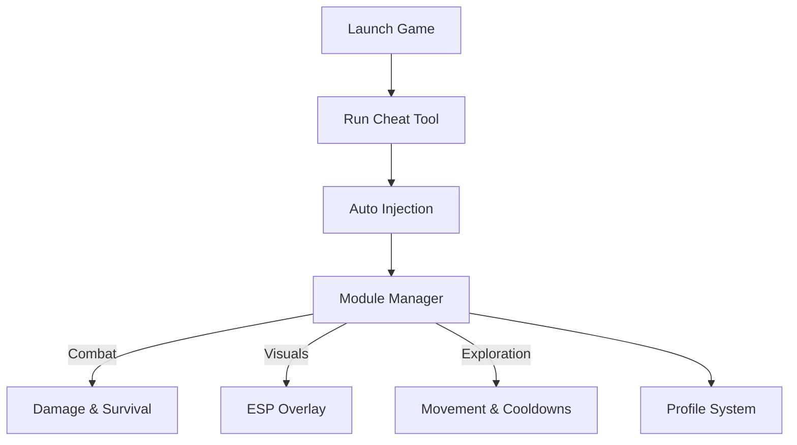

## 🌅 When the Red Sands Yield to Your Will

The world of **Crimson Desert** is vast, merciless, and breathtakingly alive. Wind howls across battlefields, steel sings in desperate hands, and every choice carries weight. The **Crimson Desert Cheat Software** is crafted for players who wish to *bend* this world without breaking it—shaping difficulty, testing combat systems, and exploring freely while preserving immersion.

This is not chaos unleashed. It is control, measured and intentional, like reins held lightly over a warhorse.

---

## 🧭 Overview — A Tool for Mastery, Not Noise

Designed as a modular PC enhancement, the cheat software operates in real time, giving you access to survival tools, combat tuning, and awareness systems—all reversible, all optional. Whether you’re learning boss patterns, farming resources, or simply wandering the open world without constant interruption, the tool adapts to your rhythm.

Think of it as a hidden layer beneath the world—silent, responsive, obedient.

---

## ✨ Core Features (Modular & Customizable)

### 🛡️ Survival & Endurance

* **God Mode (Toggle)** — Explore hostile zones without fatal consequences.
* **Unlimited Health & Stamina** — Perfect for extended fights and traversal testing.
* **No Hunger / Fatigue** — Keep momentum during long sessions.

### ⚔️ Combat & Damage Control

* **Damage Multiplier** — Scale outgoing power with fine precision.
* **Enemy Damage Reducer** — Soften punishment without removing threat.
* **One-Hit Option** — For rapid clears or mechanic testing.

### 👁 Awareness & Vision Tools

* **ESP Overlay** — Enemies, NPCs, loot, and objectives visible through terrain.
* **Boss Highlighting** — Track elite threats during chaotic encounters.
* **Distance Filters** — Clean visuals, no clutter.

### 🧭 Exploration Enhancements

* **Movement Speed Slider** — Faster travel across vast landscapes.
* **No Cooldowns** — Experiment freely with skills and abilities.
* **Stealth Stability** — Prevent accidental detection during scouting.

> [!NOTE]
> Each module works independently. Enable only what the moment demands.

---

## ⚡ Setup — Claiming Control

1. Launch **Crimson Desert** and load into the game world.
2. Run the **Cheat Software** as administrator.
3. Attach automatically to the game process.
4. Open the menu using the hotkey (`Insert` by default).
5. Toggle features gradually and save profiles.

```text
Starter configuration:
- Unlimited Stamina
- Enemy Damage: 0.6x
- ESP: Enemies + Loot (medium range)
```

> [!IMPORTANT]
> Begin subtly. The world feels richest when danger still breathes.

---

## 🔄 Internal Flow (How It Works)



All changes apply instantly and vanish the moment the tool is closed.

---

## ❓ FAQ — Questions from the Battlefield

**Is this safe for my saves?**
Yes. The tool does not modify save files or game assets.

**Does it work offline only?**
Designed strictly for single-player use.

**Can I save different presets?**
Yes. Profiles can be swapped mid-session for combat, exploration, or testing.

**Will updates break it?**
Minor patches are usually fine. Major updates may require a refreshed build.

**Is it beginner-friendly?**
Clean UI, clear labels, and sliders make it approachable even for first-time users.

---

## 🛑 A Quiet Warning

> [!WARNING]
> Overusing invulnerability can dull the epic scale of combat. Use power as seasoning, not the meal.

Let challenge return once understanding is earned.

---

## 🔥 Final Thoughts — Power, Tempered

The **Crimson Desert Cheat Software** is for explorers, testers, and warriors who want agency over their journey. It allows learning without frustration, freedom without chaos, and mastery without shortcuts that cheapen the road.

The desert remains fierce—but now, it listens when you speak.
